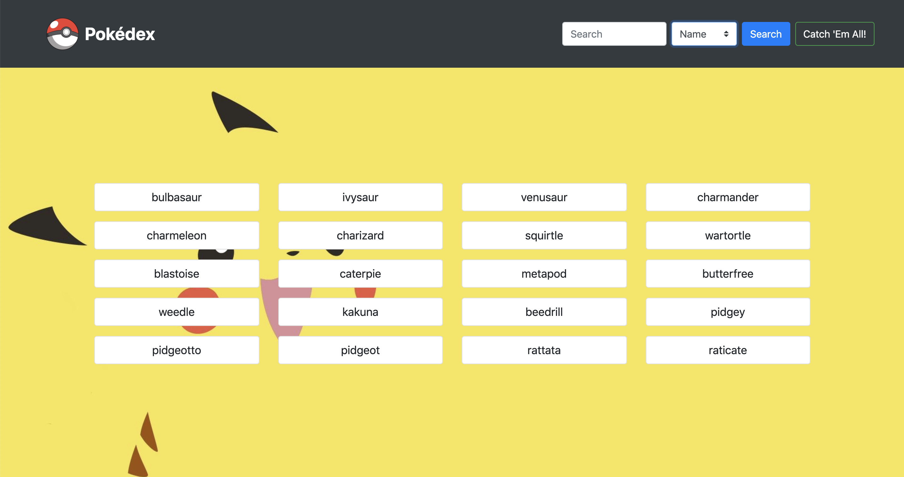

# Pokedex Lab

You've already worked with the [PokéApi](https://pokeapi.co/) in class. Now it's
time to use it on your own! Using the API, create a Pokédex where users can not
only browse a list of Pokémon characters, but also search for their favorites!

Starter code is provided for you, which includes some HTML and CSS. The styling
is provided by [Bootstrap](https://getbootstrap.com/docs/4.3/layout/grid/),
which is already linked in the `head` of the HTML boilerplate, and your `script`
file is connected in the `body`. When you finish the base requirements, look
into Bootstrap for the bonuses!

## Prerequisites

- DOM & Events
- APIs & AJAX

## Instructions

1. Fork and clone this repository.
2. Change into the new directory.
3. Fulfill the listed requirements.
4. Submit your solution with a pull request on this repository.

Please turn in your submission by the deadline on your cohort calendar.

## Requirements

1. Create a submit button called "Catch 'Em All!" that, when clicked, makes a
   request to the PokéApi and lists all Pokémon in the browser. Each character
   should appear in `section#results` element include the Pokémon's name.
2. Add an input field/search bar with a submit button called "Search". When the
   user enters the name of the Pokémon and clicks submit, a request is made to
   the PokéApi and the approprate Pokémon's name should appear in the
   `section#results` element. The new results should clear out any existing
   results before displaying the new results.
3. Add a dropdown that includes the following options: Name, Ability, Location
   and Move.
4. Focus the search based on the option the user selects for the dropdown menu.
   When the Search button is clicked, make a request to the PokéApi to search
   the Pokémon property that matches the selected option for what is in the
   input field.
5. If the input does match any data from the PokéApi, create an alert that says
   "No matches! Try something else!"

## Bonus

- Use [Bootstrap](https://getbootstrap.com/) to style your form input and
  pokemon search results
- Make your Pokédex responsive using the
  [Bootstrap grid](https://getbootstrap.com/docs/4.3/layout/grid/)!
- For the "Name" and "Catch 'Em All" searches, show the image of the pokemon in
  the results.

## Plagiarism

Take a moment to refamiliarize yourself with the
[Plagiarism policy](https://git.generalassemb.ly/DC-WDI/Administrative/blob/master/plagiarism.md).
Plagiarized work will not be accepted.

## [License](LICENSE)

1.  All content is licensed under a CC­BY­NC­SA 4.0 license.
2.  All software code is licensed under GNU GPLv3. For commercial use or
    alternative licensing, please contact legal@ga.co.
